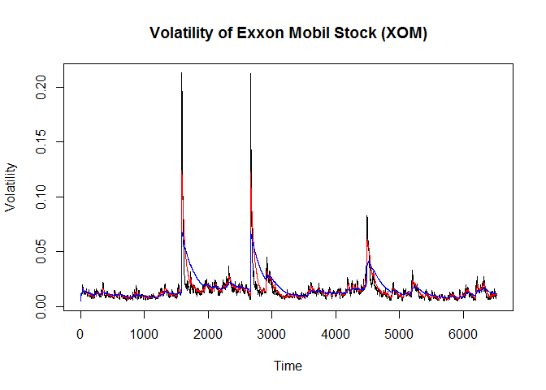

# Lecture Assignment 11
Marc Naples  
November 14, 2016  
# Doing Data Science - Lecture Assignment 11 - Naples, Marc

For this assignment, I examined the price volatility of Exxon Mobil stock (stock ticker "XOM"). The code below loads the library for analysis in R, and downloads the price history of XOM. From there, the code calculates log returns of the stock price, and calculates the volatility.


```r
# Package setup
library(tseries)
```

```
## Warning: package 'tseries' was built under R version 3.3.2
```

```r
# Basic data download, calculate log return and volatility
XOMdata <- get.hist.quote("xom", quote="Close")
```

```
## time series ends   2016-11-11
```

```r
XOMreturn <- log(lag(XOMdata)) - log(XOMdata)
XOMvol <- sd(XOMreturn) * sqrt(250) * 100
```

From here, I continue to analyze the volatility of XOM with a function that calculates continuing volatility per a chosen decay factor.


```r
# Volatility Calculator function
CalcVol <- function(d, logrets) {
  var = 0
  lam = 0
  varlist <- c()
  for (r in logrets) {
    lam = lam*(1 - 1/d) + 1
    var = (1 - 1/lam)*var + (1/lam)*r^2
      varlist <- c(varlist, var)
  }
  sqrt(varlist)}
```

WIth the preliminary setup complete, we can calculate volatility by 3 different decay factors, per v1 (10), v2 (30)and v3 (100).


```r
# creating volatility estimates
v1 <- CalcVol(10,XOMreturn)
v2 <- CalcVol(30,XOMreturn)
v3 <- CalcVol(100,XOMreturn)
```

Lastly, we can plot the continuing volatility measures per the 3 different decay factors


```r
plot(v1, type="l", ylab = "Volatility", xlab = "Time", main = "Volatility of Exxon Mobil Stock (XOM)" )
lines(v2, type="l", col = "red")
lines(v3, type="l", col = "blue")
```

<!-- -->

As the chart shows, the volatility of Exxon Mobil stock remains fairly constant, albeit with 3 brief dramatic shocks.
